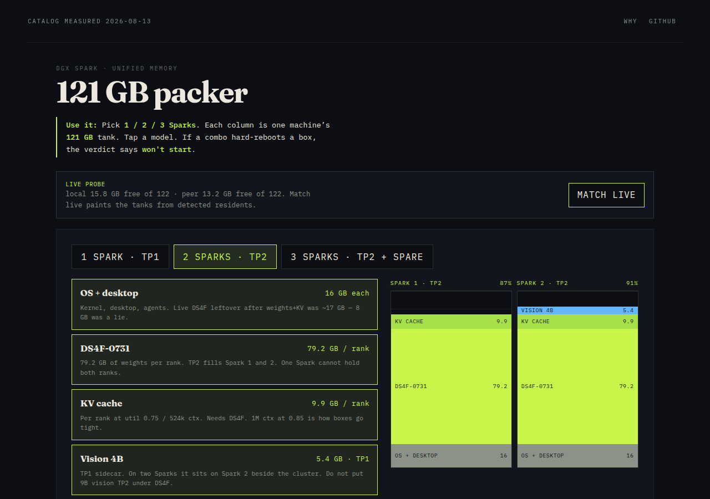

# spark-pack



Pack models onto **1–3 NVIDIA DGX Sparks** before you start them. Each machine is a **121 GB** tank. The verdict is **FITS**, **TIGHT**, or **won't start**.

## At a glance

| | |
|---|---|
| **What it is** | A visual memory packer for DGX Spark unified memory — measured residents, mutual exclusion, live probe. |
| **What it’s for** | So you do not hard-reboot a box by co-residing H3 with DS4F, or treating 2×121 GB as one pool. |
| **How to use it** | Open `index.html`, or `./setup.sh` → `http://127.0.0.1:8768/` |

## Try it (pick one)

### One command
```bash
git clone https://github.com/Coinupbtc/spark-pack.git
cd spark-pack && ./setup.sh
```

### Copy-paste
```bash
git clone https://github.com/Coinupbtc/spark-pack.git && cd spark-pack
python3 -m http.server 8768 --bind 127.0.0.1
# open http://127.0.0.1:8768/
```

### No Spark
Open `index.html` in a browser. The catalog is the product. `./probe.sh` is optional and only reads `free`, ports, and docker names.

## What the tanks mean

121 GB is **per Spark**, not a shared cluster pool. TP2 DS4F puts ~79 GB of weights on **each** rank. That is why two Sparks look full, not half empty.

| Verdict | Meaning |
|---------|---------|
| **FITS** | ≥15 GB headroom on the fullest Spark |
| **TIGHT** | Fits, but earlyoom country. Live DS4F clusters live here. |
| **Won't start** | Over 121 GB, or H3 on one Spark, or a measured kill combo |

H3 + DS4F is the measured kill combo (89.4 GB on Spark 1). Vision 4B can sit on Spark 2 beside the cluster.

`docker stats` under-reports unified memory. Believe `free` and the dated sizes in `catalog.json`.

## Live probe

On a Spark:

```bash
./probe.sh
# optional second node:
SPARK_PACK_PEER=user@other-spark ./probe.sh
```

Then refresh the packer and hit **Match live**. Nothing is started or stopped.

## Not this repo

- Starting DS4F — use the upstream DSpark recipe, not this packer.
- Generic “does 70B q4 fit?” math — that is [sparkfit](https://github.com/engineering87/sparkfit).
- A results museum — every catalog row has an `as_of` date.

## License

MIT
